# Detectify System Flowchart

## Overview
Detectify is a production-ready object detection system that processes images, videos, and live webcam feeds using TensorFlow models, stores detection events in a database, and provides REST API access with optional IoT integration.

---

## System Architecture Flowchart

```mermaid
flowchart TB
    Start([System Start]) --> Init[Initialize System]
    Init --> LoadConfig[Load Configuration<br/>Pydantic Settings]
    LoadConfig --> InitDB[Initialize Database<br/>SQLAlchemy + Aleeverthing mbic]
    InitDB --> CheckMode{Execution Mode?}
    
    CheckMode -->|CLI| CLIMode[CLI Inference Mode]
    CheckMode -->|API| APIMode[FastAPI Server Mode]
    CheckMode -->|IoT| IoTMode[ESP32 Integration Mode]
    
    %% CLI Flow
    CLIMode --> CLISource{Source Type?}
    CLISource -->|Image| ProcessImage[Load Image File]
    CLISource -->|Video| ProcessVideo[Load Video File]
    CLISource -->|Webcam| ProcessWebcam[Open Camera Device]
    CLISource -->|Stream| ProcessStream[Connect to RTSP/HTTP Stream]
    
    %% API Flow
    APIMode --> StartServer[Start Uvicorn Server]
    StartServer --> WaitRequest[Wait for HTTP Request]
    WaitRequest --> APIRoute{API Endpoint?}
    
    APIRoute -->|/health| HealthCheck[Return Health Status]
    APIRoute -->|/detect| DetectUpload[Receive Image Upload]
    APIRoute -->|/detect/live| LiveStream[Start MJPEG Stream]
    APIRoute -->|/detections| QueryDB[Query Detection History]
    APIRoute -->|/cameras| ListCams[List Available Cameras]
    
    DetectUpload --> ValidateImage[Validate Image Format]
    ValidateImage -->|Invalid| ReturnError[Return 400 Error]
    ValidateImage -->|Valid| DecodeImage[Decode Image Bytes]
    
    LiveStream --> OpenCamera[Open Camera Device]
    OpenCamera --> StreamLoop[Stream Loop]
    StreamLoop --> CaptureFrame[Capture Frame]
    CaptureFrame --> RunDetection
    
    %% Detection Pipeline
    ProcessImage --> RunDetection[Run Object Detection]
    ProcessVideo --> VideoLoop[Video Frame Loop]
    VideoLoop --> RunDetection
    ProcessWebcam --> WebcamLoop[Webcam Frame Loop]
    WebcamLoop --> RunDetection
    ProcessStream --> StreamLoop
    DecodeImage --> RunDetection
    
    RunDetection --> LoadModel{Model Loaded?}
    LoadModel -->|No| LoadTFModel[Load TensorFlow Hub Model<br/>SSD-MobileNet-V2/EfficientDet]
    LoadModel -->|Yes| RunInference[Run TF Model Inference]
    LoadTFModel --> RunInference
    
    RunInference --> Preprocess[Preprocess Image<br/>BGR→RGB, Resize]
    Preprocess --> TFInference[TensorFlow Inference]
    TFInference --> Postprocess[Postprocess Results<br/>Filter by Confidence<br/>Convert Coordinates]
    Postprocess --> Detections[List of Detections]
    
    Detections --> CheckPerson{Person Detected?}
    CheckPerson -->|Yes| CheckConfidence{Confidence < Threshold?}
    CheckPerson -->|No| SaveToDB
    CheckConfidence -->|Yes| MarkUnauthorized[Mark as Unauthorized]
    CheckConfidence -->|No| SaveToDB
    MarkUnauthorized --> TriggerAlert[Trigger Alert System]
    
    TriggerAlert --> CheckNotifications{Notifications Enabled?}
    CheckNotifications -->|Yes| SendEmail[Send Email Alert<br/>SMTP]
    CheckNotifications -->|No| CheckIoT
    SendEmail --> CheckIoT{IoT Enabled?}
    CheckIoT -->|Yes| SendIoT[Send Alert to ESP32<br/>HTTP POST]
    CheckIoT -->|No| SaveToDB
    
    SaveToDB --> CreateEvent[Create Detection Event]
    CreateEvent --> SaveCrop{Save Crops Enabled?}
    SaveCrop -->|Yes| CropImage[Extract & Save Bounding Box Crop]
    SaveCrop -->|No| InsertDB
    CropImage --> InsertDB[Insert into Database<br/>SQLite/PostgreSQL]
    
    InsertDB --> DrawBoxes[Draw Bounding Boxes on Image]
    DrawBoxes --> OverlayInfo[Overlay FPS & Detection Count]
    OverlayInfo --> OutputResult{Output Format?}
    
    OutputResult -->|Image| SaveImage[Save Annotated Image]
    OutputResult -->|JSON| ReturnJSON[Return JSON Response]
    OutputResult -->|Stream| EncodeFrame[Encode as JPEG]
    OutputResult -->|Display| ShowWindow[Display in OpenCV Window]
    
    SaveImage --> EndCLI([CLI Complete])
    ReturnJSON --> EndAPI([API Response Sent])
    EncodeFrame --> StreamLoop
    ShowWindow --> CheckContinue{Continue?}
    CheckContinue -->|Yes| VideoLoop
    CheckContinue -->|Yes| WebcamLoop
    CheckContinue -->|No| EndCLI
    
    HealthCheck --> EndAPI
    QueryDB --> FilterDetections[Apply Filters<br/>Camera, Class, Time Range]
    FilterDetections --> Paginate[Paginate Results]
    Paginate --> EndAPI
    ListCams --> EndAPI
    ReturnError --> EndAPI
    
    %% IoT Integration
    IoTMode --> ESP32Connect[ESP32 Connects to Server]
    ESP32Connect --> ESP32Sensors[ESP32 Sensors Active<br/>HC-SR04, PIR]
    ESP32Sensors --> SensorTrigger{Sensor Triggered?}
    SensorTrigger -->|Ultrasonic| CheckDistance{Distance ≤ 15cm?}
    SensorTrigger -->|PIR| MotionDetected[Motion Detected]
    
    CheckDistance -->|Yes| CaptureESP32[Capture Image via ESP32-CAM]
    MotionDetected --> CaptureESP32
    CaptureESP32 --> ESP32Detect[ESP32 Person Detection<br/>Confidence Calculation]
    ESP32Detect --> ESP32Post[POST to /api/detection<br/>JSON + Image]
    ESP32Post --> ReceiveESP32[Server Receives Detection]
    ReceiveESP32 --> RunDetection
    
    EndCLI --> End([End])
    EndAPI --> WaitRequest
    End --> Stop([System Stop])
```



---

## Key Components

### 1. **Input Sources**
- **Image Files**: JPEG, PNG, BMP, WebP
- **Video Files**: MP4, AVI, MOV, MKV, WebM
- **Live Webcam**: Direct camera access (DirectShow on Windows)
- **Streams**: RTSP, HTTP, HTTPS video streams
- **API Uploads**: Multipart file uploads via FastAPI

### 2. **Detection Engine**
- **Model**: TensorFlow Hub (SSD-MobileNet-V2 or EfficientDet)
- **Classes**: 91 COCO classes (person, car, bicycle, etc.)
- **Processing**: BGR→RGB conversion, tensor preparation, inference, post-processing
- **Filtering**: Confidence threshold, NMS (IoU threshold)

### 3. **Database Layer**
- **ORM**: SQLAlchemy 2.0
- **Database**: SQLite (default) or PostgreSQL
- **Migrations**: Alembic
- **Schema**: Detection events with metadata (bbox, confidence, timestamp, camera_id, etc.)

### 4. **API Endpoints**
- `GET /health` - Health check with model status
- `POST /detect` - Single image detection (returns image or JSON)
- `GET /detect/live` - MJPEG live stream with detections
- `GET /detections` - Paginated query with filters
- `GET /cameras` - List available camera devices

### 5. **Alert System**
- **Email Notifications**: SMTP-based alerts for unauthorized detections
- **IoT Integration**: HTTP POST to ESP32 devices
- **Rate Limiting**: Cooldown periods to prevent spam

### 6. **Output Formats**
- **Annotated Images**: Bounding boxes, labels, confidence scores
- **JSON Responses**: Structured detection data
- **MJPEG Streams**: Live video with overlay
- **Database Logs**: Persistent audit trail

---

## Data Flow Example: Image Detection via API

```
1. Client → POST /detect (multipart/form-data)
2. Server validates image format
3. Decode image bytes → OpenCV array
4. Load TF model (lazy, thread-safe singleton)
5. Preprocess: BGR→RGB, add batch dimension
6. Run TensorFlow inference
7. Postprocess: filter by confidence, convert normalized coords
8. For each detection:
   - Check if person + low confidence → unauthorized
   - Save crop if enabled
   - Insert into database
   - Trigger alerts if unauthorized
9. Draw bounding boxes on image
10. Overlay FPS/detection count
11. Encode as JPEG
12. Return HTTP response (image/jpeg or application/json)
```

---

## IoT Integration Flow (ESP32)

```
ESP32 Device:
├── Sensors (HC-SR04, PIR) → Trigger detection
├── Camera (OV2640) → Capture image
├── Person Detection → Calculate confidence
└── POST /api/detection → Send to server

Server:
├── Receive detection event
├── Process through main detection pipeline
├── Store in database
└── Send email alert if unauthorized
```

---

## Configuration Flow

```
Environment Variables / .env
    ↓
Pydantic Settings (config.py)
    ↓
Application Settings
    ├── Model: TF-Hub URL, confidence threshold
    ├── Database: Connection string
    ├── API: Host, port
    ├── Notifications: SMTP settings
    └── IoT: ESP32 endpoints
```

---

## Error Handling

- **Invalid Image**: Returns 400 Bad Request
- **Model Not Loaded**: Raises RuntimeError
- **Camera Unavailable**: Returns 503 Service Unavailable
- **Database Error**: Logs and continues (graceful degradation)
- **Network Error (IoT)**: Queues for retry on ESP32

---

## Performance Optimizations

- **Lazy Model Loading**: Model only loaded when needed
- **Thread-Safe Singleton**: Prevents duplicate model loads
- **Rate Limiting**: DB writes throttled (1 per second for webcam)
- **Frame Sampling**: Video processing samples every 10th frame for DB
- **Connection Pooling**: SQLAlchemy connection management
- **Multi-stage Docker**: Optimized image sizes (GPU/CPU variants)
